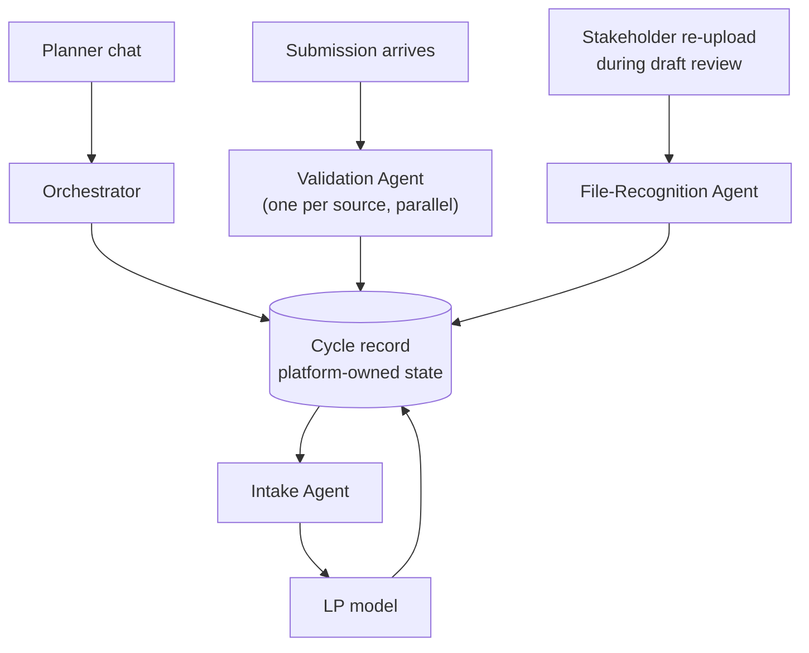
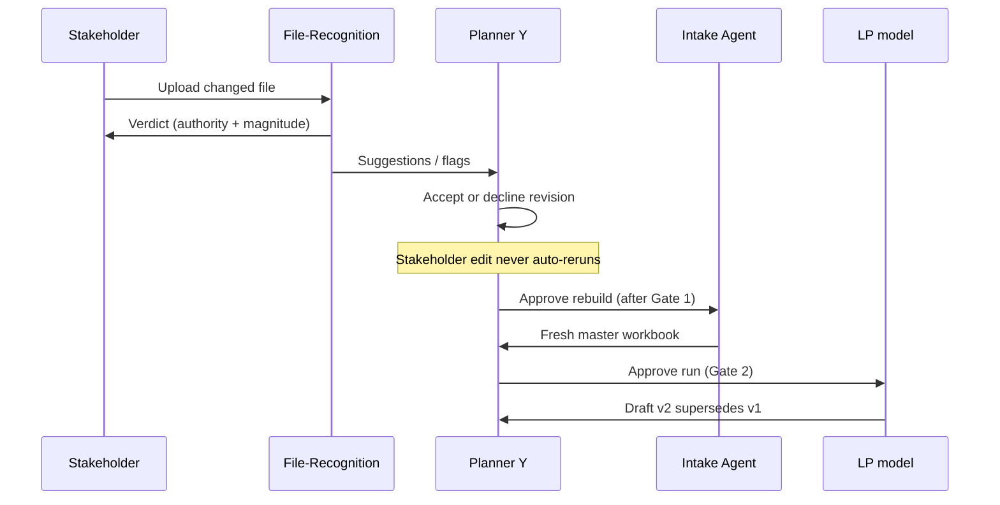

# SROP Platform — Agent Workflow & Presentation Brief

> **Important for the receiving AI:** You will **not** have access to any source code repository, internal files, or live system. **Everything you need is in this document.** Do not assume you can look up additional specs. Use only what is written here. If a detail is marked **Platform fact**, treat it as accurate product behavior. If marked **Presentation rationale**, use it for compelling narrative but do not present it as a shipped feature unless it is also listed as a platform fact.

**Your task:** Use this brief to create presentations, diagrams (Mermaid or equivalent), and speaker notes that explain (1) the **business problem**, (2) how the **SROP automation platform** solves it, and (3) the **roles and benefits of four agents**.

**Audience:** Executives, operations leaders, and technical stakeholders evaluating agent-based orchestration for a monthly supply-planning cycle.

**Organization context:** A large refining operation runs a monthly **Short Range Operating Plan (SROP)**. One planner coordinates six external data sources, validates submissions, merges them into one optimizer input, runs a linear-programming (LP) model, circulates a draft plan, collects stakeholder feedback, and publishes a final plan.

---

## 1. The business problem (today)

### What SROP is

The **Short Range Operating Plan (SROP)** is a monthly exercise: one planner (**Y**) coordinates **six data sources** — **Demand Planning**, **OSPAS**, and **four refineries** (YANBU, JAZAN, RIYADH, RABIGH) — to build a **four-month supply plan**.

The **LP optimizer** (existing black-box model) requires **one standardized multi-sheet Excel workbook**. In the manual process:

- Stakeholders submit Excel files by email  
- Y chases late responders  
- Y checks numbers informally  
- Y manually merges six different file shapes  
- Y runs the model, emails a draft, collects comments, re-merges, re-runs  
- Y archives whatever version everyone last agreed on  

### Pain points the platform targets

| Pain today | Why it hurts |
|---|---|
| **One person holds the whole process in their head** | Miss a routine ask, forget an escalation, or merge the wrong file version — and the plan is wrong before anyone notices. |
| **Six sources, six shapes** | Prices, demand, tank levels, and limits arrive in different layouts, column names, and granularities. Y becomes the human ETL layer every month. |
| **Bad data reaches the optimizer** | A 64% demand spike or a cross-plant limit mix-up can slip through if validation is informal or inconsistent. |
| **No reproducible audit trail** | “Who approved this number?” and “which file version fed the run?” are email archaeology, not a system answer. |
| **Draft review is unsafe at scale** | Letting refineries edit “their” cells without checking authority or magnitude invites silent scope creep. |
| **The planner is the bottleneck** | Chasing, merging, validating, emailing, and re-running are all on Y — while the business still expects a plan on schedule. |

### The promise of the solution

> **Agents prepare work and surface decisions. Y crosses gates.**

The platform does not replace the planner’s judgment. It removes repetitive coordination and arithmetic that bury judgment under busywork — and makes every step **visible, attributable, and reproducible**.

---

## 2. Solution in one paragraph

Y describes what he needs in plain language. The **Orchestrator** drafts per-recipient requests (never sends without review). Stakeholders submit through the platform. A **Validation Agent** instance runs **in parallel per source**, raising flags with evidence. Y triages flags; the **Intake Agent** builds the **master workbook** only from clean or justified data. Y approves the workbook and runs the LP model. Stakeholders review the draft; the **File-Recognition Agent** checks uploads for authority and sanity. Accepted changes loop back through intake and plan. Y publishes the final SROP. Everything is logged on a **cycle record** the platform owns — agents are stateless: structured input in, structured result out.

---

## 3. Who is involved

### People and identities

| Role | Identity | Can do |
|---|---|---|
| **Planner (Y)** | Y — SROP Planner | Everything: initiate cycle, send requests, triage flags, override thresholds, run LP, issue draft, accept revisions, publish final. **Only actor with system-wide authority.** |
| **Demand Planning** | Demand Planning | Submit product prices; review draft SROP |
| **OSPAS** | OSPAS | Submit demand per refinery / bulk plant / product (4-month horizon); review draft |
| **Refineries** | Refinery YANBU, JAZAN, RIYADH, RABIGH | Submit tank levels and (when asked) limits/outages; review draft for their refinery |
| **Finance** | Finance | Submit nothing; review and approve draft from financial-impact view |

**Seven identities** total. In the demo, a header dropdown switches identity — no real login.

### Field-level authority (who may edit what)

| Identity | Owns |
|---|---|
| OSPAS | `demand_kb` for every series |
| Demand Planning | `price_usd` for every product-month |
| Refinery *R* | `opening_inventory_kb`, `min_level`, `max_level`, `capacity`, `outage_days` — only for bulk plants belonging to refinery *R* |
| Finance | Nothing; comment and approve only |
| Y | Everything |

**Platform fact:** A change outside an identity’s scope is **not rejected**. It is quarantined, flagged `OUT_OF_SCOPE_EDIT`, and routed to Y as a **suggestion** — because a refinery spotting a wrong price is useful information.

### Data landscape (for realistic diagrams)

| Dimension | Values |
|---|---|
| Refineries | YANBU, JAZAN, RIYADH, RABIGH |
| Bulk plants | BP-YANBU, BP-MADINAH (YANBU); BP-JAZAN (JAZAN); BP-RIYADH, BP-QASSIM (RIYADH); BP-RABIGH (RABIGH) |
| Products | DIESEL, GASOLINE-91, GASOLINE-95, JET-A1, FUEL-OIL, ASPHALT |
| Horizon | Four months forward from cycle start |

Limits and capacity are defined **per bulk plant**, not per refinery alone — an important detail for validation and plan screens.

---

## 4. End-to-end workflow (monthly cycle)

### Phase map

```mermaid
flowchart LR
  subgraph P1["Phase 1 — Initiate"]
    A[Y describes ask in chat]
    B[Orchestrator drafts requests]
    C[Y reviews and sends]
  end
  subgraph P2["Phase 2 — Collect"]
    D[Stakeholders submit files]
    E[SLA reminders / escalations]
  end
  subgraph P3["Phase 3 — Validate"]
    F[Validation Agent per source]
    G[Y triages flags]
  end
  subgraph P4["Phase 4 — Consolidate"]
    H[Intake Agent builds master workbook]
  end
  subgraph P5["Phase 5 — Plan"]
    I[Y approves workbook — Gate 2]
    J[LP model → Draft SROP]
  end
  subgraph P6["Phase 6 — Draft review"]
    K[Stakeholders approve / comment / upload]
    L[File-Recognition on uploads]
    M[Y accepts revisions → rerun loop]
  end
  subgraph P7["Phase 7 — Finalise"]
    N[All settled → Final SROP]
    O[Archive]
  end
  A --> B --> C --> D --> E --> F --> G --> H --> I --> J --> K --> L --> M
  M -.->|data changed| H
  K --> N --> O
```

### Seven platform phases (UI tracker)

1. **Initiate** — Requests drafted and sent  
2. **Collect** — Waiting on submissions  
3. **Validate** — Per-source validation and flag triage  
4. **Consolidate** — Master workbook build  
5. **Run plan** — LP run after planner approval  
6. **Draft review** — Stakeholder review and revision loop  
7. **Finalise** — Published and archived  

### Planner screens (for UI mockups in slides)

| # | Screen | Phase |
|---|---|---|
| 1 | Cycle Home | Status board — all phases |
| 2 | Requests | Initiate — chat + request cards |
| 3 | Submissions | Collect — one card per stakeholder |
| 4 | Validation | Validate — flag triage |
| 5 | Data Dashboard | Compare any value vs history/limits |
| 6 | Master File & Plan Run | Consolidate + run LP |
| 7 | Draft SROP Review | Stakeholder responses queue |
| 8 | History | Audit archive |

Stakeholders see: **My Tasks**, **Submit Data**, **Review Draft SROP** (Finance has no Submit).

### Four gates (where Y must act)

| Gate | What it blocks | Opens when |
|---|---|---|
| **Gate 1 — Validation** | Progression to intake / plan | No open flags; every requested submission received **or** explicitly **assumed** after Y confirms day-7 fallback |
| **Gate 2 — Run authority** | LP run | Master workbook exists, is **not stale**, and Y has approved it for the run |
| **Gate 3 — Issue** | Sending draft to stakeholders | Y chooses to issue; draft not already issued |
| **Gate 4 — Finalization** | Publishing final SROP | Every stakeholder settled (approved, deemed approved, or comment resolved and re-confirmed); no open comments; **rerun completed** if data changed after draft was issued |

**Presentation line:** *Gates are the product. Automation that skips a gate would be faster and wrong.*

**Platform fact:** A stakeholder editing a value during draft review **never** auto-reruns the LP model. The edit queues for Y; Y accepts or declines; only then does intake rebuild and Y approve a new run.

---

## 5. Agent architecture (how they work together)

### Three design principles (all agents)

1. **No agent crosses a gate.** Agents prepare; Y decides.  
2. **Every agent fails loudly.** No silent drops, guesses, or “looks clean because it crashed.”  
3. **No agent holds state.** Each run: relevant slice in → structured result out → platform writes result + audit entry.

### Deterministic code vs language model

| Work | Where it runs | Why |
|---|---|---|
| Rules, thresholds, diffs, authority checks, plan arithmetic, timers, gates | **Code** | Exactly one correct answer; must be reproducible |
| Email prose, orchestrator chat, flag plain-English, natural-language edits, stakeholder chat | **LLM with template fallback** | No single correct answer — only clearer or less clear wording |

**Platform fact — measured lesson:** An early prototype used a language model to run validation rules. Three runs at temperature zero gave three different wrong answers: fabricated flags, validating Jazan’s inventory against Yanbu’s limits, and missing most planted defects. **Validation was moved to code.** Narration stayed with the model.

---

## 6. The four agents — roles, benefits, and “why not…?”

---

### 6.1 Orchestrator

**Tagline:** The coordinator — active for the whole cycle.

| | |
|---|---|
| **Triggers** | Y sends chat on Requests; a request is sent; SLA timers fire; any state transition in the cycle |
| **Reads** | Chat text, previous cycle request log, stakeholder directory, current cycle record |
| **Writes** | Request drafts, email drafts, reminders/escalations, audit entries, learned justification patterns |

**What it does in practice**

1. **Request drafting** — Turns “standard pull plus ask Jazan about the October outage” into six structured request cards.  
2. **Completeness checking** — Compares against last cycle’s log; refuses to guess when the ask is ambiguous.  
3. **SLA management** — Day 3 reminder, day 5 escalation to management, day 7 **fallback prepared for Y** (not auto-applied).  
4. **Audit** — Every transition logged with actor and timestamp.  
5. **Learning** — When Y justifies a flag, the pattern is remembered; next cycle the flag still fires but carries prior context (e.g. *“Justified last cycle: seasonal Hajj uplift, confirmed by OSPAS.”*). Flags are **never suppressed** — only annotated.

**Real benefit**

- **Y stops being the reminder system.** Timers run whether Y is in a meeting or on leave.  
- **Routine asks don’t get dropped.** Template comparison catches “you always ask OSPAS for demand — you didn’t mention it this time.”  
- **Natural language in, structured work out** — Y thinks in business terms; the platform thinks in recipients, items, and due dates.  
- **Nothing sends without review** — Automation drafts; accountability stays human.

#### Audience Q&A — Orchestrator

**Q: Why an Orchestrator agent? Why doesn’t Y just send the emails himself?**

**A (platform fact):** The orchestrator compares against the prior cycle template, structures per-recipient requests, runs the SLA ladder, and writes audit entries — work that is repetitive and error-prone when done manually every month.

**A (presentation rationale):** Email is not the workflow; it is one output. The real work is *knowing what to ask whom, by when, with what follow-up* — and proving you asked consistently. A single chat turn that fans out to six correct, reviewable request cards replaces an hour of copy-paste and CC management.

---

**Q: Why not one big workflow in SAP / email rules instead of an agent?**

**A (presentation rationale):** SAP knows transactions; it does not know “ask Jazan about the outage” until someone structures it. Email rules can remind; they cannot interpret ambiguous planner intent or compare against last month’s *ad-hoc* asks. The orchestrator sits in the **interpretation and coordination** layer between human intent and system actions.

---

**Q: If the orchestrator misunderstands Y, does the cycle break?**

**A (platform fact):** It asks clarifying questions instead of guessing. If parsing fails, Y can edit request cards manually. Orchestrator failure never blocks the cycle.

---

### 6.2 Validation Agent

**Tagline:** One instance per submission — all sources validated in parallel.

| | |
|---|---|
| **Triggers** | Submission arrives; file replaced; flag correction changes a value |
| **Reads** | Submission data, 12-month baseline, refinery reference tables, threshold overrides, peer submissions (for cross-source rules) |
| **Writes** | Flags; submission status |

**Six validation rules (order matters)**

Applied in this sequence: structural → bounded → statistical → relational.

| Rule | Fires when | Default severity |
|---|---|---|
| `ZERO_OR_MISSING` | Required numeric field empty, zero, or negative | High for prices; medium for demand |
| `UNKNOWN_ENTITY` | Refinery, bulk plant, or product absent from reference tables | Medium |
| `LIMIT_BREACH` | Tank level outside min/max, or production exceeds capacity | High |
| `HISTORICAL_DEVIATION` | Value deviates from 12-month baseline mean beyond threshold (default **50%**) | High if &gt;100%; medium if 50–100% |
| `CROSS_SOURCE_CONFLICT` | Demand exists with no price, or aggregate demand exceeds plant capacity | Medium |
| `OUT_OF_SCOPE_EDIT` | Stakeholder changed a field they do not own (also used in draft review) | High |

**Output contract (platform fact):** Every flag must include **evidence** (submitted value and value compared against) and **plainEnglish** a non-analyst can act on. A flag missing either is not shown — it is logged as an agent defect.

**Flag lifecycle (for swimlanes):** open → emailed / corrected / justified → clean. Re-validation runs after every change.

**Real benefit**

- **Catches bad data before the optimizer** — see demo proof point in Section 9.  
- **Parallel = speed and isolation** — OSPAS does not wait for YANBU; a validation crash on one source does not mark others clean.  
- **Reproducible defense** — Y can show *why* a number was questioned, with the same result every run.  
- **Cross-source checks** — Demand vs capacity only when both sides exist.

#### Audience Q&A — Validation

**Q: Why a Validation *agent*? Why not Excel conditional formatting or a BI dashboard?**

**A (platform fact):** Six rule types, cross-source dependencies, re-validation after every correction, and a strict evidence contract are implemented as deterministic code — not ad-hoc spreadsheet logic.

**A (presentation rationale):** Dashboards show numbers; they do not **block the plan** or **route accountability** to the source. Validation is a **gate**, not a chart. The agent turns policy into an enforceable state machine: flagged → emailed → resolved → clean.

---

**Q: Why not let the LLM validate? It can read spreadsheets.**

**A (platform fact):** Early LLM-based validation was non-reproducible — wrong flags, missed defects, wrong limit lookups across plants.

**A (presentation rationale):** A planner who must defend a flag to a refinery director needs the **same answer on Tuesday as on Thursday**. Arithmetic has one answer; prose has many. Split the work accordingly.

---

**Q: Why parallel agents instead of one validator for the whole cycle?**

**A:** Independent failure domains and faster wall-clock time. Refinery YANBU’s file can validate while OSPAS is still uploading. One monolithic job would couple every source’s fate and slow the critical path.

---

### 6.3 Intake Agent

**Tagline:** The consolidator — builds the one workbook the LP model accepts.

| | |
|---|---|
| **Triggers** | Y closes last open flag; accepted revision changes data; Y clicks Rebuild |
| **Reads** | All submissions at current version, reference tables, carried-forward assumed data |
| **Writes** | Master workbook + per-cell source trace |

**Rules**

1. Only validated data enters (clean, justified, corrected, or explicitly assumed).  
2. Every cell traces to submission + version.  
3. Excluded series are carried, not dropped (e.g. LPG-95 with no reference limits — planner must confirm exclusion).  
4. Assumed data is marked in the workbook itself, not only in the UI.  
5. Staleness is tracked by the platform — stale workbook cannot pass Gate 2.

**Real benefit**

- **Y is not the monthly merge macro** — six shapes become one LP-ready artifact.  
- **Traceability survives email** — any plan number can be traced to who submitted it and when.  
- **Safe reruns** — when a flag is fixed or a revision accepted, intake rebuilds; planner approves before run.  
- **Assumptions are visible** — stale carry-forward is labeled on the draft, not hidden.

#### Audience Q&A — Intake

**Q: Why an Intake agent? Why not role-based access — each department writes directly into the master template?**

**A (platform fact):** Submissions arrive as separate files per source. The Intake Agent maps validated data into the multi-sheet master workbook the LP model reads, with a source trace on every cell.

**A (presentation rationale — strong slide material):**

- **Data is never in the same format twice.** Demand Planning sends prices; OSPAS sends a demand cube; each refinery sends tank levels and limits — different sheets, column orders, units, and grain (refinery vs bulk plant vs product vs month).  
- **Role-based editing assumes one shared schema.** In reality, sources use their own Excel culture. Forcing everyone into one template on day one is a multi-year change-management project; intake meets them where they are.  
- **The optimizer needs one shape, not six.** Intake is the **contract enforcement layer** between messy organizational reality and a rigid LP input spec.  
- **Validation must finish before merge.** Role-based co-editing would let unvalidated numbers appear in the master file. Intake only pulls from **clean or justified** submissions.  
- **Audit requires provenance.** “Who put 41.2 in October?” is answered by the trace, not by whoever had edit rights on a shared sheet.

---

**Q: Why not point the LP model at six files directly?**

**A:** The LP is a black-box optimizer with a fixed input contract. Six files mean six failure points at run time. Intake centralizes normalization, exclusion handling, and assumption labeling **before** the expensive run.

---

**Q: Why rebuild automatically? Isn’t that expensive?**

**A (platform fact):** Rebuild marks the workbook stale immediately; the LP run still requires Y to approve a fresh build (Gate 2). Building is cheap; running LP on wrong data is expensive.

---

### 6.4 File-Recognition Agent

**Tagline:** The gatekeeper on stakeholder self-service during draft review.

| | |
|---|---|
| **Triggers** | Stakeholder uploads a changed file while reviewing the draft SROP |
| **Reads** | Upload, issued draft, authority map (see Section 3), reference tables, baseline |
| **Writes** | Authority verdict; `draft_review` flags |

**Rules**

1. Identify file shape from **columns**, not filename — closed set: `inventory`, `limits`, `demand`, `prices`, `unrecognised`.  
2. Diff against issued draft — exact changed cells.  
3. Authority per cell — in-scope vs `OUT_OF_SCOPE_EDIT` (quarantined as suggestions to Y).  
4. Magnitude — extreme values flag even when in authority.  
5. **Verdict shown to uploader first** — withdraw before it hits Y.

**Example verdict (for slides):** *“You changed 3 values. 2 are within your authority. 1 — GASOLINE-91 price for 2026-11 — is owned by Demand Planning and will be sent to the planner as a suggestion.”*

**Real benefit**

- **Self-service without silent sabotage** — refineries can propose updates; they cannot quietly edit Demand Planning’s prices.  
- **Mistakes caught at the source** — most out-of-scope edits are accidents; showing the verdict to the uploader saves a round trip.  
- **Y sees suggestions, not chaos** — out-of-scope changes become a structured queue, not mystery attachments.  
- **Unrecognised files are a verdict, not a crash** — stakeholder gets guidance to re-upload or comment.

#### Audience Q&A — File-Recognition

**Q: Why not trust stakeholders to only edit their rows?**

**A (presentation rationale):** Good actors still make mistakes — wrong sheet saved, wrong month column, price cell nudged while fixing inventory. Authority maps are **policy**; the agent is **enforcement**. Trust is for people; verification is for systems.

---

**Q: Why show the verdict to the stakeholder before Y?**

**A (platform fact):** Most out-of-scope edits are mistakes; catching them at upload avoids polluting Y’s queue.

**A (presentation rationale):** It trains the organization. Stakeholders learn domain boundaries by feedback, not by rejection emails three days later.

---

**Q: Why not use the same Validation Agent on re-upload?**

**A:** Validation asks “is this submission plausible against history and limits?” File-Recognition asks “**what did you change vs the draft we issued, and were you allowed to change it?**” Different question, different moment in the cycle. A refinery might submit valid inventory that is still out of scope on the draft review screen.

---

## 7. SLA and escalation (Orchestrator-owned)

| Elapsed (business days) | Action | Who decides |
|---|---|---|
| 3 | Reminder to stakeholder | Automatic |
| 5 | Escalation to department head, Y copied | Automatic |
| 7 | Fallback **prepared** (carry forward prior month, mark `assumed`, label `STALE_ASSUMED` on affected series) | **Y must confirm** |

Same ladder applies to flag queries and draft review non-response.

**Platform fact:** On day 7 the orchestrator does **not** proceed alone. Y must confirm because carrying stale data into a plan is a business decision, not a timeout.

**Presentation line:** *Automation escalates; it does not substitute stale data for judgment on day 7.*

---

## 8. Revision loop (draft review → intake → plan)

---

## 9. Suggested slide narrative

### Slide 1 — Title
**From one planner’s inbox to a governed monthly cycle**

### Slide 2 — Problem
One person, six sources, four months, Excel everywhere, optimizer unforgiving.

### Slide 3 — Insight
Split **reproducible rules** (code) from **natural language** (LLM). Agents handle preparation; Y holds gates.

### Slide 4 — Workflow map
Use the Phase map diagram (Section 4).

### Slide 5 — Four agents
Use the architecture diagram (Section 5) — one card per agent with tagline + one benefit bullet.

### Slide 6 — Proof point (demo story — use these exact numbers)

**Platform fact (pinned demo scenario):**

| Item | Value |
|---|---|
| Series | JAZAN, bulk plant BP-JAZAN, product DIESEL, October |
| Submitted demand | **41.2 kb** |
| 12-month baseline mean | **25.1 kb** |
| Deviation flagged | **+64%** (`HISTORICAL_DEVIATION`) |
| After OSPAS correction | **25.8 kb** |
| Plan revenue impact of correction | **−$1.45M** (October swing **−15.4 kb** on movable rows) |

**Story arc:** Flag caught **before** LP run → evidence visible on screen → stakeholder corrects → plan changes materially → audit trail intact.

**Planted defects in demo dataset:** Exactly **eight** validation defects across dirty fixtures (for credibility — the demo is deterministic).

### Slide 7 — Why Intake (anticipated objection)
“Why not role-based templates?” → **Six formats in, one format for LP, validation before merge, full traceability.**

### Slide 8 — Gates
Four moments where the platform refuses to proceed until Y acts.

### Slide 9 — Outcome
Faster cycle, fewer silent errors, defensible audit, planner time shifted from chasing to deciding.

### Slide 10 — Honest scope (what the demo is / isn’t)

**Platform facts about the demo build:**

| Real in the app | Simulated / stubbed |
|---|---|
| Cycle state, flags, gates, approvals, audit trail | Authentication (role switcher only) |
| Deterministic validation rules | Email delivery (drafted and stored, not sent) |
| Request drafting, SLA logic, flag triage | User uploads (accepted visually; fixtures drive numbers) |
| Master workbook generation (downloadable) | LP model (deterministic `buildPlan()` arithmetic, not external optimizer) |
| LLM polish for emails and chat (with offline fallback) | SAP / production integrations |

The **logic design** is intended to be portable to an enterprise agent platform (e.g. Cohere North) without changing rules.

---

## 10. Key messages for diagrams

| Visual | Emphasize |
|---|---|
| **Swimlane** | Y vs Orchestrator vs Validation vs Intake vs File-Recognition vs LP |
| **Before/after** | Email + spreadsheets vs cycle record + gates |
| **Parallel validation** | Six stakeholder cards validating simultaneously |
| **Gate checkpoints** | Closed until Y acts |
| **Data lineage** | Submission → flag → correction → intake cell trace → plan row |
| **Authority boundary** | Green in-scope / amber out-of-scope on File-Recognition verdict |
| **Phase tracker** | Seven steps with four gates between them on Cycle Home |

---

## 11. Glossary

| Term | Meaning |
|---|---|
| **Cycle record** | Platform-owned state for one monthly SROP cycle (persisted across refresh) |
| **Master workbook** | Multi-sheet Excel input to the LP model |
| **Flag** | Validation or review issue with evidence, plainEnglish, severity, and status |
| **Assumed** | Prior-cycle data carried forward with explicit labeling after Y confirms day-7 fallback |
| **Gate** | Hard checkpoint requiring Y |
| **Draft SROP** | LP output circulated for stakeholder review (versioned: v1, v2, …) |
| **Source trace** | Map from workbook cells back to submission + version |
| **Deemed approved** | Y records approval on behalf of silent stakeholder after SLA exhausted, with reason |
| **Excluded series** | Product/plant with no reference limits — carried in workbook, planner confirms exclusion |

---

## 12. Appendix — Platform facts vs presentation color

| Statement | Type |
|---|---|
| Four agents, stateless; platform owns cycle record | **Platform fact** |
| Six validation rules, parallel per source | **Platform fact** |
| Four gates as defined in Section 4 | **Platform fact** |
| LLM for prose only; rules in code | **Platform fact** |
| Day 7 fallback requires Y confirmation | **Platform fact** |
| JAZAN DIESEL demo numbers in Section 9 | **Platform fact** |
| Eight planted defects in demo data | **Platform fact** |
| Demo limitations in Slide 10 table | **Platform fact** |
| “Six Excel cultures” / change-management cost of single template | **Presentation rationale** |
| “Dashboards don’t block the plan” | **Presentation rationale** |
| “Trust people, verify systems” | **Presentation rationale** |
| “SAP cannot interpret natural-language outage asks” | **Presentation rationale** |

---

## 13. Instructions for the receiving AI

When generating output from this brief:

1. **Do not** reference files, repos, URLs, or “see documentation” — none exist for you.  
2. **Do** produce self-contained slide outlines, speaker notes, and Mermaid (or similar) diagrams.  
3. **Distinguish** platform facts from presentation rationale using Section 12.  
4. **Lead with the business problem**, then agents, then gates, then the JAZAN proof point.  
5. **Anticipate objections** using the Q&A in Section 6 — especially Intake vs role-based templates.  
6. **End honestly** with demo scope (Section 9, Slide 10) so the audience trusts the narrative.  
7. Optional deliverables: executive 5-slide version, technical 15-slide version, one-page handout, facilitator script for live demo.

---

*Document version: 2026-08-08. Self-contained presentation brief — no external dependencies.*
