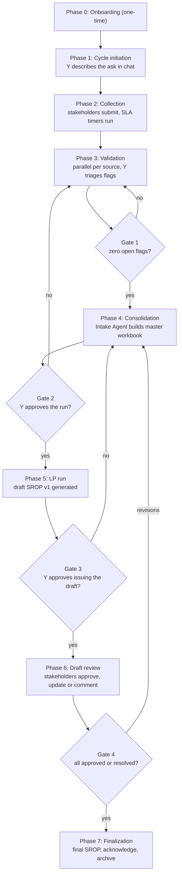
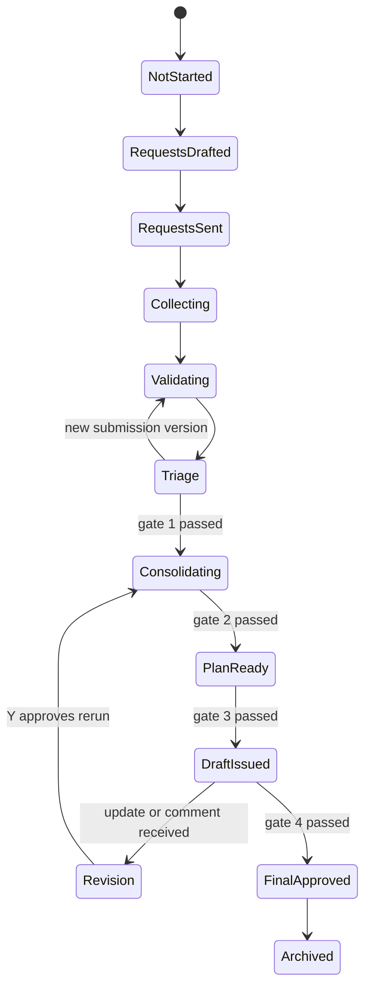

# Version 2 — Full Business Logic & UI Scope

## Overview

Version 1 is one screen that proves one claim: bad stakeholder data can be caught before it reaches the optimizer. It starts with four CSV files already sitting on disk and ends with a plan comparison table.

Version 2 is the platform around that claim. It covers the whole monthly SROP cycle — Y asks each department for data, the departments submit it themselves, the platform validates it, Y triages what is wrong, the data is consolidated into the master workbook, the LP model produces a draft, every stakeholder reviews that draft, and the approved result is archived. Version 1's validation logic survives intact inside it as one screen out of eight.

This document is the business logic and the behavior spec together. It is written in the same style as [version1.md](version1.md): what is on each screen, what state it can be in, and what happens when the user acts. Where a version 1 behavior carries over unchanged, this document says so and does not respecify it.

It supersedes the narrative in [SROP_Automation_Business_Logic_Scope.md](SROP_Automation_Business_Logic_Scope.md), which described the same process but left its business rules open. Those rules are resolved here.

### What version 2 adds

| Capability | Version 1 | Version 2 |
|---|---|---|
| Screens | one scrolling page | eight planner screens plus three stakeholder screens, one left nav |
| Who uses it | Y only | Y plus six stakeholder identities, switched from the header |
| Where data comes from | four CSVs pre-staged on disk | stakeholders submit through the platform, per request |
| Request initiation | none | Y describes the ask in chat, the orchestrator drafts and sends it |
| Chasing stakeholders | none | reminder and escalation timers with a non-response fallback |
| State after refresh | lost | persisted to a JSON file per cycle |
| Validation | four rules, one pass | six rules, per-source parallel runs, re-validation after every change |
| Consolidation | implicit | an Intake Agent that assembles the multi-sheet master workbook |
| Plan | one table, submitted against validated | the plan reviewed against its constraints and against history, pivotable by any dimension |
| Draft review | none | stakeholders approve, update, or reject with a comment |
| Finalization | none | final SROP, acknowledgment, archive |
| Audit | none | every action recorded with actor and timestamp |

### Where the version 1 panes went

| Version 1 pane | Version 2 home |
|---|---|
| `SubmissionsPane` | Screen 3, **Submissions** — same cards, now with request and SLA state, and one card per stakeholder rather than per file |
| `FlagsPane` | Screen 4, **Validation** — same flag cards, same evidence line, same five statuses, plus escalation and two new rules |
| `PlanPane` | Screen 6, **Master File & Plan Run** — same gate and same refusal behavior, but the before/after table is replaced. See the rule below and section 7.6 |

Everything else on the nav is new.

### A rule about comparisons

Version 1's plan table has columns `Month`, `Refinery`, `Product`, `Submitted`, `Validated`, `Δ`. Across roughly 32 rows, one of them shows a non-zero delta. The other 31 read `12.9 kb — 12.9 kb — 0.0 kb`.

That table answers "did validation change anything." It is a good answer to a question Y has already answered: he made every correction himself, one at a time, on the Validation screen, and approved each one. By the time he reaches the plan, the last thing he needs is 31 rows confirming that the numbers he did not change did not change.

What he needs at that moment is whether the plan is any good. So version 2 adopts one rule, and section 7.6 is where it bites hardest:

> **Every comparison on screen must be against something the planner can act on.** A plan number is only meaningful next to the constraint it might breach, the demand it might fail to serve, or the history that says whether it is plausible. A number next to its own unchanged self is not a comparison.

Three concrete defects in version 1 follow from breaking that rule, and all three are fixed in version 2:

1. **The comparison has no reference.** Submitted against validated is a counterfactual about the platform, not a fact about the plan. Retired from the plan screen in version 2. The arithmetic survives, moved to the moment it informs a decision: section 7.4 shows the effect of a single correction on the confirmation step, before Y commits it, so he knows what the correction is worth while he is deciding whether to make it.
2. **The decision numbers are computed and then discarded.** `buildPlan()` in [lib/plan.ts](lib/plan.ts) already returns `closing` inventory and `shortfall` for every row, and already holds `capacity`, `min_level` and `max_level` to compute them. Version 1 displays none of the four. Shortfall is unmet demand — the single most consequential output of a supply plan — and it is nowhere on the screen.
3. **The bulk plant is dropped.** `buildPlan()` joins on `refinery|bulkPlant|product`, and every limit is defined per bulk plant, but `PlanRow` carries only refinery and product. A row reading `YANBU / DIESEL` therefore cannot be checked against any limit. In version 2, where YANBU and RIYADH each have two bulk plants, that same row would also be ambiguous — two distinct plants rendered as one indistinguishable line.

The same rule was applied to the excluded row, to the stakeholder's view of the draft, and to the rerun comparison. Each is noted where it appears.

### What stays fake

Version 2 is still a demo. The scope of the pretence is fixed and deliberate:

- **Authentication is a role switcher.** A header control changes who you are. There is no login, no password, no session.
- **Uploads are accepted and ignored.** The upload control takes a real `.csv` or `.xlsx`, shows it being received and parsed, and then the platform proceeds with the pre-generated fixture for that source. Nothing the user drops in changes the numbers.
- **Email is drafted, never sent.** Drafts are real, editable, and stored. Delivery is simulated, as is the stakeholder's reply.
- **The LP model is a stub.** `buildPlan()` in [lib/plan.ts](lib/plan.ts) keeps its arithmetic exactly as it is — it is deterministic maths, not an optimizer. The only change is that it must carry out the values it already computes internally, listed in section 3.
- **The master workbook is generated, not parsed.** The platform builds a real multi-sheet file from the validated data so it can be inspected and downloaded. It never reads one back.

Everything else — the cycle state, the flags, the approvals, the audit trail — is real within the app.

---

## 1. Actors and roles

### People

| Role | Identity in the switcher | Can do |
|---|---|---|
| **Planner (Y)** | `Y — SROP Planner` | Everything. Initiates the cycle, sends requests, triages flags, overrides thresholds, runs the LP model, publishes the draft and the final SROP. The only actor with system-wide authority. |
| **Demand Planning** | `Demand Planning` | Submits product prices. Reviews the draft SROP. |
| **OSPAS** | `OSPAS` | Submits demand per refinery per bulk plant per product for the four-month horizon. Reviews the draft SROP. |
| **Refinery** | `Refinery YANBU`, `Refinery JAZAN`, `Refinery RIYADH`, `Refinery RABIGH` | Submits opening inventory (tank levels) and, when asked, updated limits, min/max and outage. Reviews the draft SROP for its own refinery. |
| **Finance** | `Finance` | Submits nothing. Reviews and approves the draft SROP from a financial-impact view. |

Seven identities in total. The switcher is a plain dropdown in the header showing the current identity and, next to it, a count of that identity's open tasks.

### Field-level authority

Authority is the rule that makes stakeholder self-service safe. Each identity owns a set of fields, and the platform will not silently accept a change outside that set.

| Identity | Owns |
|---|---|
| OSPAS | `demand_kb` for every series |
| Demand Planning | `price_usd` for every product-month |
| Refinery *R* | `opening_inventory_kb`, `min_level`, `max_level`, `capacity`, `outage_days` — but only for bulk plants belonging to refinery *R* |
| Finance | nothing; comment and approve only |
| Y | everything |

A change outside an identity's set is not rejected. It is accepted into a holding area, flagged as `OUT_OF_SCOPE_EDIT`, and routed to Y, who decides. This is deliberate: a refinery noticing a wrong price is useful information, and refusing it outright would throw that information away.

### Agents

Described in full in section 9. In short:

| Agent | Runs when | Produces |
|---|---|---|
| **Orchestrator** | continuously | request drafts from Y's chat, reminder and escalation emails, storage and audit writes |
| **Validation Agent** | on every submission, one instance per source, in parallel | flags with evidence |
| **Intake Agent** | after Y closes out all flags, and again after every approved revision | the master workbook |
| **File-Recognition Agent** | on every stakeholder re-upload during draft review | an authority verdict plus any out-of-scope or extreme-value flags |

---

## 2. The monthly cycle

One cycle covers one issue of the SROP and always plans a four-month horizon. The cycle for September 2026 plans `2026-09` through `2026-12`.



### The four gates

Gates are the whole point of the platform. Each one is a place where the process used to depend on Y remembering something.

| Gate | Condition | Enforced where |
|---|---|---|
| **Gate 1 — validation** | no flag in the cycle is `open`, `awaiting_response`, `responded` or `escalated`, and every requested submission is `clean`, `included` or `assumed` | Screen 6, the Run Plan button. Carried over from version 1's gate. |
| **Gate 2 — run authority** | Y explicitly approves the master workbook | Screen 6. The Intake Agent never triggers the LP model on its own. |
| **Gate 3 — issue** | Y explicitly approves sending the draft to stakeholders | Screen 7. |
| **Gate 4 — finalization** | every stakeholder is `approved`, or their comment is `resolved` and they have re-confirmed | Screen 7, the Publish Final button. |

Nothing crosses a gate automatically. A stakeholder editing a value does not rerun the LP model; it queues a revision that Y must review and approve first. This is the single most important rule in the system, and it exists because Y is accountable for the output.

### Phase 0 — onboarding

Runs once, before the first cycle, and is not part of the monthly loop.

1. Historical demand and price baselines are loaded — twelve months, used for deviation detection.
2. Refinery reference tables are loaded — bulk-plant min/max, capacity, outage calendar. These change irregularly and have no upstream API, so they are uploaded and then amended by refineries on request.
3. The stakeholder directory is loaded — who exists, what they own, where their email goes, who their escalation contact is.

In the demo, all three arrive as pre-generated fixtures and the screen simply reports them as loaded.

---

## 3. Data objects

### The cycle record

One JSON file per cycle at `data/state/cycle-<YYYY-MM>.json`, plus `data/state/index.json` listing every cycle and its status. This is the simplest persistence that survives a refresh and lets two role identities see the same state, which is all that is required.

```
CycleRecord
  id                 "2026-09"
  status             CycleStatus
  horizon            ["2026-09","2026-10","2026-11","2026-12"]
  createdAt          ISO timestamp
  requests           Request[]
  submissions        Submission[]
  flags              Flag[]
  thresholdOverrides ThresholdOverride[]
  masterFile         MasterFile | null
  drafts             Draft[]              // v1, v2, … newest last
  reviews            StakeholderReview[]  // one per stakeholder per draft
  comments           Comment[]
  finalSrop          FinalSrop | null
  audit              AuditEntry[]
```

### Request

What Y asked for, from whom. Reused as the template for the next cycle.

```
Request
  id, cycleId
  recipient          identity
  items              string[]        // "prices for all products, 4-month horizon"
  dueDate            ISO date
  emailDraft         { to, subject, body }
  status             draft | sent
  sentAt             ISO timestamp | null
  remindedAt         ISO timestamp | null
  escalatedAt        ISO timestamp | null
```

### Submission

One per source per cycle. A source that submits twice produces two versions on the same submission, not two submissions.

```
Submission
  id, cycleId
  source             identity
  status             SubmissionStatus
  files              [{ name, sizeKb, kind: csv|xlsx, rowCount, columns[], receivedAt }]
  versions           [{ n, receivedAt, note, fixtureRef }]
  flagIds            string[]
  assumed            boolean          // carried from last cycle after non-response
  includedInMasterAt ISO timestamp | null
```

### Flag

Extends the version 1 `Flag` in [lib/types.ts](lib/types.ts). Every field version 1 had is kept, including `evidence`, which stays mandatory and still carries both numbers.

```
Flag
  ...all version 1 fields...
  origin             validation | draft_review | intake
  status             FlagStatus       // v1's five, plus escalated
  escalatedAt        ISO timestamp | null
  raisedAgainst      submissionId | draftId
  history            [{ at, actor, from, to, note }]
```

### Comment

A rejection of a specific draft value with a justification. No file involved. Routed straight to Y.

```
Comment
  id, cycleId, draftId
  author             identity
  rowRef             "refinery=JAZAN,product=DIESEL,month=2026-10"
  quotedValue        string
  text               string
  status             open | accepted | declined
  plannerResponse    string | null
  resolvedAt         ISO timestamp | null
```

### Master file and draft

```
MasterFile
  id, cycleId
  builtAt, builtFromFlagCount
  sheets             [{ name, rowCount, columns[] }]
  downloadPath
  approvedByPlanner  boolean

Draft
  id, cycleId
  version            1, 2, 3 …
  generatedAt
  planRows           PlanRow[]        // extended, below
  excluded           ExcludedSeries[]
  totalRevenue, totalVolume
  shortfallRowCount, bandBreachRowCount
  changesFromPrevious [{ rowRef, before, after, causedBy }]
  status             generated | issued | superseded | finalized
```

### PlanRow, extended

Version 1's `PlanRow` in [lib/types.ts](lib/types.ts) is `{ month, refinery, product, production, closing, shortfall, revenue }`. Every column on the Feasibility and Reasonableness tabs is either already there or already available to `buildPlan()` at the moment it builds the row — it is simply not carried out. The extension is therefore additive and cheap:

```
PlanRow
  month, refinery, product         // v1
  bulkPlant                        // NEW — the join key already uses it; limits are defined on it
  demand                           // NEW — `required`, already local to the loop
  production, closing, shortfall   // v1
  opening                          // NEW — `available`, already local to the loop
  capacity, minLevel, maxLevel     // NEW — already read from the limit row
  price                            // NEW — already read to compute revenue
  revenue                          // v1
  baselineMean                     // NEW — joined from history for the Reasonableness tab
  lastCycleValue                   // NEW — joined from the previous cycle's final SROP, may be null
  assumed                          // NEW — true when this row rests on carried-forward data
```

`bulkPlant` is the important one. Without it no row on any screen can be checked against a limit, and two bulk plants under one refinery collapse into indistinguishable rows.

```
ExcludedSeries
  refinery, bulkPlant, product
  months             string[]
  demandKb           number          // the volume at stake, so the row states a consequence
  reason             "no reference limits"
  decision           pending | limits_added | exclusion_confirmed
  decidedBy, decidedAt, note
```

### Stakeholder review

One row per stakeholder per issued draft. This is the object Gate 4 counts.

```
StakeholderReview
  id, cycleId, draftId
  stakeholder        identity
  status             ReviewStatus
  respondedAt
  updateSubmission   { fixtureRef, verdict, flagIds[] } | null
  commentIds         string[]
```

### Audit entry

Every state transition anywhere in the system appends one of these. Nothing is ever deleted or overwritten in place.

```
AuditEntry
  at, actor, action, target, before, after, note
```

### API surface

Thin route handlers over the JSON store. The two version 1 routes are kept and joined by the rest.

| Route | Purpose |
|---|---|
| `POST /api/cycle` | create a cycle |
| `GET /api/cycle/:id` | read the whole cycle record |
| `POST /api/requests/draft` | Y's chat text in, structured request drafts out |
| `POST /api/requests/send` | mark requests sent, start SLA timers |
| `POST /api/submissions/:source` | accept an upload, attach the fixture, set status |
| `POST /api/validate` | **version 1 route, extended** — now scoped to one source and writes flags to the store |
| `PATCH /api/flags/:id` | status transitions, notes, corrections |
| `POST /api/intake` | build the master workbook |
| `POST /api/generate` | **version 1 route, extended** — now versions the draft into the store |
| `POST /api/drafts/:id/issue` | issue to stakeholders, create review rows |
| `POST /api/reviews/:id` | approve, update or comment |
| `POST /api/final` | publish and archive |

---

## 4. Business rules

### Validation rules

Version 1's four rules, plus two. Every rule produces a flag carrying an `evidence` string with both the submitted number and the number it was compared against — the credibility line, unchanged from version 1.

| Rule | Fires when | Default severity |
|---|---|---|
| `HISTORICAL_DEVIATION` | the value deviates from the twelve-month baseline mean for that series by more than the threshold | high above 100%, medium 50–100% |
| `LIMIT_BREACH` | a tank level falls outside `min_level`/`max_level`, or required production exceeds `capacity` | high |
| `ZERO_OR_MISSING` | a required numeric field is empty, zero or negative | high for prices, medium for demand |
| `UNKNOWN_ENTITY` | a refinery, bulk plant or product is absent from the reference tables | medium |
| `CROSS_SOURCE_CONFLICT` | *(new)* demand exists for a series with no price, or aggregate demand exceeds plant capacity across the horizon | medium |
| `OUT_OF_SCOPE_EDIT` | *(new)* a stakeholder changed a field they do not own | high |

`UNKNOWN_ENTITY` never removes data. The series stays in the dataset and appears on the plan as an explicit excluded row — version 1's LPG-95 behavior, preserved.

### Threshold policy

The historical deviation threshold defaults to **50%**, globally, for every series. Y can override it, and only Y can.

- An override is scoped to a product, a bulk plant, or a single series.
- It requires a reason, which is stored and shown next to the override.
- It applies from the moment it is set and persists into future cycles until removed.
- Overrides are listed on the Data Dashboard so they never become invisible policy.

The intended use is seasonality: if JET-A1 at BP-JAZAN legitimately doubles every Hajj season, Y raises that series' threshold once with a reason rather than re-justifying the same flag every year.

### Response SLA and escalation

Timers start when a request is sent and are measured in business days.

| Elapsed | What happens | Who acts |
|---|---|---|
| 3 days, no submission | reminder email to the stakeholder | orchestrator, automatic |
| 5 days, no submission | escalation email to that stakeholder's department head, Y copied | orchestrator, automatic |
| 7 days, no submission | orchestrator prepares a **non-response fallback** and surfaces it on Cycle Home | Y must confirm |

The same ladder applies to a flag query sent to a stakeholder, and to a stakeholder who has not responded to an issued draft.

### Non-response fallback

At day 7 the orchestrator does not proceed on its own. It assembles the fallback and asks Y to confirm it, because carrying stale data into a plan is a business decision, not a timeout.

On confirmation:

- That source's data is copied from the previous cycle, shifted forward one month.
- The submission is marked `assumed`.
- A medium `STALE_ASSUMED` note is attached to every affected series and travels all the way onto the draft SROP, where it is visible to every stakeholder.
- The cycle continues. Gate 1 treats `assumed` as satisfied.

If Y declines, the cycle holds and Cycle Home shows it as blocked on that source.

### Run authority

Only Y triggers an LP run. The Intake Agent can rebuild the master workbook automatically whenever underlying data changes, but building the workbook and running the model are separate acts, separated by Gate 2.

A stakeholder update during draft review therefore never reruns anything. It lands in Y's revision queue. Y reviews the queue, accepts or declines each item, and only then approves a rerun. The result is draft v2, which supersedes v1.

### Approval bar

The draft becomes final when every stakeholder has either approved it, or had their comment resolved and re-confirmed the resolution. A stakeholder who is silent does not count as approving; they go through the same SLA ladder, and the same day-7 fallback, which for draft review means Y may record a **deemed approved** with a reason.

Y's sign-off then publishes. Y cannot publish over an unresolved comment.

### New entities

A new product, bulk plant, refinery or stakeholder appearing in a submission is never auto-provisioned. It raises `UNKNOWN_ENTITY`, is quarantined out of the reference tables, and waits for Y. Y either adds it — which requires supplying the missing reference rows, since a series without limits cannot be planned — or leaves it excluded for the cycle.

### Versioning

Every submission version, flag transition, threshold override, master workbook build, LP run, stakeholder response and approval is retained and attributable. Nothing is overwritten. The History screen reads directly from this.

---

## 5. State models

### Cycle



### Submission

`requested → reminded → escalated → submitted → validating → flagged → resolving → clean → included`

Two side exits: `assumed`, entered from `escalated` when Y confirms the fallback; and a return from `clean` to `submitted` if the source sends a new version, which restarts validation for that source only.

### Flag

Version 1's five statuses, unchanged in meaning, plus one:

`open → awaiting_response → responded → corrected`
`open → justified` (note required, empty rejected)
`awaiting_response → escalated` (new — SLA expired on the query)

Gate 1 opens when no flag is `open`, `awaiting_response`, `responded` or `escalated`. Version 1's rule with `escalated` added.

### Stakeholder review of a draft

`notified → viewed → (approved | update_submitted | comment_submitted) → planner_reviewed → awaiting_confirmation → confirmed`

`approved` goes straight to `confirmed`. The other two go through Y. `deemed_approved` is a terminal state reachable from `notified` or `viewed` after the SLA ladder expires and Y records a reason.

---

## 6. Application shell

Every screen sits inside the same shell. The shell is the only navigation in the app; there are no nested tabs, no modals stacked on modals, and no screen reachable only from another screen.

### Header

- product name and the active cycle, e.g. `SROP — Cycle 2026-09`
- cycle status pill, showing the `CycleStatus` in plain words: `Collecting submissions`, `In validation`, `Draft under review`
- **role switcher** — a dropdown listing all seven identities, with a badge showing that identity's open task count
- the current phase number out of seven

Switching identity swaps the entire nav and reloads the screen set. It does not change any data. It is a view of the same cycle record through different eyes, and the audit trail records actions against whichever identity was active.

### Left nav — planner (Y)

Eight entries, each tied to exactly one phase of the cycle, in the order the phases happen:

| # | Screen | Phase |
|---|---|---|
| 1 | Cycle Home | all — the status board |
| 2 | Requests | 1 |
| 3 | Submissions | 2 |
| 4 | Validation | 3 |
| 5 | Data Dashboard | 3, and any time after |
| 6 | Master File & Plan Run | 4 and 5 |
| 7 | Draft SROP Review | 6 |
| 8 | History | 7 |

Each entry shows a count badge when it needs attention — open flags on Validation, pending responses on Draft SROP Review — and a check mark once its phase is complete. Screens for phases not yet reached are visible but disabled, with a one-line reason on hover, so the shape of the whole process is legible from the first minute.

### Left nav — stakeholder

Three entries: **My Tasks**, **Submit Data**, **Review Draft SROP**. Finance sees only My Tasks and Review Draft SROP, because Finance submits nothing.

---

## 7. Planner screens

### 7.1 Cycle Home

The status board. Y opens the platform here on the first of the month, and returns here to answer anything the platform needs a decision on.

#### Visible elements

- **Phase tracker** — seven steps across the top, each `done`, `active` or `pending`, with the four gates drawn between them and marked open or closed
- **Start New Cycle button** — visible only when no cycle is open. Creates the cycle, sets the four-month horizon from the current month, and moves Y to Requests
- **Needs your decision** — the action queue, described below
- **Cycle at a glance** — four counters: submissions received of requested, open flags, draft version, stakeholders approved of total
- **Recent activity** — the last ten audit entries in plain sentences, e.g. `Refinery JAZAN submitted tank levels — 2 flags raised`

#### The decision queue

This is the screen's reason to exist. Anything the platform cannot decide on its own appears here as a card with the question, the context, and the buttons that resolve it. There are five kinds:

| Card | Appears when | Buttons |
|---|---|---|
| Non-response fallback | a source has been silent 7 business days | `Use last cycle's data` / `Hold the cycle` |
| New entity | `UNKNOWN_ENTITY` was raised | `Add to reference tables` / `Exclude for this cycle` |
| Revision queue | stakeholders submitted updates or comments on the issued draft | `Review revisions` — goes to screen 7 |
| Rerun approval | revisions are accepted and the master workbook is stale | `Approve rerun` / `Not yet` |
| LP failure | the model returned infeasible or errored | `View diagnostics` / `Notify stakeholders of delay` |

Each card states its own consequence in one line before the buttons. The fallback card, for example, reads: *"Refinery RABIGH has not responded in 7 business days. Proceeding will copy last cycle's tank levels forward and mark them assumed on the draft SROP."*

#### Scenarios

- **First of the month, nothing started** — phase tracker all pending, one Start New Cycle button, empty queue.
- **Mid-collection** — tracker on phase 2, counters show 4 of 6 submissions, queue empty.
- **Blocked on a decision** — queue has one or more cards; the phase tracker shows the active phase in amber rather than blue.
- **Cycle complete** — tracker all done, a summary card with the final revenue figure and a link into History.

---

### 7.2 Requests

Phase 1. Y describes what is needed in ordinary language; the orchestrator turns it into per-recipient requests that Y reviews before anything is sent.

#### Visible elements

- **Chat panel**, left — a single message box with the prompt *"What do you need this cycle, and from whom?"*
- **Draft requests panel**, right — one card per recipient, produced by the orchestrator
- **Load last cycle's requests** — a link above the chat that pre-fills the standard ask from the previous cycle's request log
- **Send All button** — bottom right, disabled until every draft card is marked reviewed

#### Chat behavior

Y types free text. The orchestrator replies in the chat with what it understood and populates the draft cards. It asks a clarifying question rather than guessing when the ask is incomplete — a missing recipient, an ambiguous horizon, an unnamed refinery.

A representative exchange:

> **Y:** Standard monthly pull. Also ask Jazan about the October outage.
>
> **Orchestrator:** I have prepared 6 requests. Standard: prices from Demand Planning, demand from OSPAS for 2026-09 to 2026-12, tank levels from all four refineries. Added to Refinery JAZAN: updated outage schedule for October 2026. Due date 3 business days from send — confirm or change.

#### Draft request card

Each card shows:

- recipient name and email
- **items** — a bulleted list of what is being asked for, each item editable inline and removable
- **due date** — defaulted to three business days, editable
- **email draft** — collapsed by default; expanding reveals editable `To`, `Subject`, `Body`, in the same layout as version 1's email editor
- **Mark reviewed** toggle

Cards carried over from the previous cycle are labelled `standard`; anything the orchestrator added from this cycle's chat is labelled `new this cycle` so Y's attention goes to the unusual asks.

#### Scenarios

- **First cycle ever** — no previous log, so the chat starts empty and Y describes everything.
- **Routine cycle** — Y clicks Load last cycle's requests, six cards appear pre-filled and pre-marked reviewed, Y adds one ad-hoc item, sends.
- **Ambiguous ask** — Y writes *"ask the refineries about limits"*; the orchestrator asks which refineries and which limits before drafting.
- **Sent** — cards become read-only with a sent timestamp and an SLA countdown; the screen gains a check mark in the nav; Y is moved to Submissions.

---

### 7.3 Submissions

Phase 2. Version 1's `SubmissionsPane`, grown into the collection tracker. One card per requested source rather than one per file.

#### Visible elements

- **Section title** with a counter: `4 of 6 received`
- **Grid of source cards**, one per recipient of a request
- **Validate All button** — runs validation across every source that has arrived and is not yet validated; the direct descendant of version 1's Run Validation button
- **Error banner** — red border and text, shown when a validation request fails, unchanged from version 1

#### Source card

Each card shows:

- source name and the status dot
- what was requested, in one line
- what arrived — file name, kind, row count, column preview, received time — repeated per file if several
- version indicator, e.g. `v2 · resubmitted 2 hours ago`, when the source has sent more than once
- SLA state for sources that have not submitted: `due in 2 days`, `reminder sent`, `escalated to department head`
- action row, varying by status

##### Status dot variants

Version 1's `StatusDot`, extended:

- gray hollow — requested, nothing received
- amber — overdue, reminder sent
- red ring — escalated
- spinner — validating
- red badge with a count — validated, that many flags
- green check — validated, clean
- gray filled with the word `assumed` — non-response fallback in use

##### Card actions

| Status | Actions |
|---|---|
| requested / overdue | `Send reminder now`, `Escalate now` |
| escalated | `Use last cycle's data` — the same fallback card as Cycle Home |
| received, not validated | `Validate` |
| validated with flags | `Review N flags` — deep links to that source's group on Validation |
| clean | `View data` — deep links to the Data Dashboard filtered to that source |
| assumed | `View carried-forward data` |

#### Scenarios

- **Nothing received yet** — six cards, all gray, all with due dates, Validate All disabled.
- **Partial arrival** — some cards populated; Validate All enabled and labelled `Validate 4 received`.
- **Validation in progress** — spinners on the sources being validated; other cards unaffected, because validation is per source and runs in parallel.
- **Validation complete** — flagged sources show red count badges, clean sources green checks, exactly as in version 1.
- **Resubmission** — a source that already validated clean sends v2; its card returns to `received, not validated` and its previously closed flags move to `superseded` in the audit rather than disappearing.
- **Validation error** — the banner appears, the affected card returns to `received, not validated`, and its Validate button stays available for retry.

---

### 7.4 Validation

Phase 3. Version 1's `FlagsPane`, essentially intact. The flag card, the evidence line, the five statuses and every transition carry over unchanged; this section documents only what version 2 adds.

#### Visible elements

- **Section title** with version 1's open count summary: `{openCount} of {total} flags open`
- **Filter bar** — by source, by rule, by severity, by status. New in version 2, because six sources produce more flags than one screen comfortably shows
- **Source groups** — one per source with flags, ordered by severity of worst flag
- **Clean source boxes** — one per clean source, green bordered, `No issues found — clean submission`, unchanged from version 1
- **Bulk actions bar** — appears when more than one flag is selected

#### Flag card

Unchanged from version 1: severity badge, rule label, file name, row reference, the monospace evidence line carrying both numbers, the italic plain-English summary, and status-dependent controls. The `Accept as justified` flow with its required note, the `Send query email` flow with its editable `To`/`Subject`/`Body`, the `Simulate response` shortcut and the `Accept correction` step all behave exactly as specified in [version1.md](version1.md).

Version 2 adds five things to the card:

- **Plan impact** — the materiality of the correction, shown at the moment Y makes it. When a proposed value feeds the plan, the platform runs the deterministic plan arithmetic on the current data with and without the change and states the difference in one line:

  > Applying **25.8** changes October production at BP-JAZAN by **−15.4 kb** and plan revenue by **−$1.45M**.

  This is the same computation version 1 put in its before/after table, moved to where it is useful. On the plan screen it was a 32-row table about corrections Y had already made. Here it is one line about a decision he is making right now, and it tells him something he cannot otherwise know: how much this correction is worth. A flag worth $1.45M deserves more scrutiny than one worth $200, and until the number is on screen the two look identical.

  It appears on the confirmation step of `Accept correction` and of the direct edit, before the change is committed, and is recorded in the flag's history. It is skipped for fields that do not reach the plan.

- **Edit the value directly** — a third button on `open` flags. Opens a single field with the current value and a natural-language box: Y types *"set it to the September figure"* and the platform resolves that to a number, shows `41.2 → 25.4` for confirmation, and applies it on accept. Requires a reason, and moves the flag to `corrected`.
- **Raise threshold for this series** — a link on `HISTORICAL_DEVIATION` flags only. Opens the override control from section 4, pre-scoped to this series, and requires a reason. On save, this flag and any sibling flags the new threshold no longer catches close as `justified` with the override text as their note.
- **SLA state** on `awaiting_response` flags — `queried 2 days ago`, then `reminder sent`, then a red `escalated` badge. The flag counts as open at every stage.
- **History strip** — a one-line-per-transition trail at the foot of the card, with actor and timestamp.

#### Bulk actions

Selecting several flags — typically all flags of one rule from one source — enables:

- `Query as one email` — a single email listing every selected row, so a refinery gets one message rather than nine
- `Justify all with one reason` — one note applied to each, each still recorded separately

#### Scenarios

- **All flags open** — Gate 1 closed; Master File & Plan Run is disabled in the nav with the reason on hover.
- **Triage in progress** — `awaiting_response` and `responded` still count as open, exactly as in version 1.
- **Query escalates** — a queried flag passes 5 business days; the orchestrator escalates, the card shows the red badge, Y can still resolve it manually at any point.
- **Direct edit** — Y corrects the value himself without emailing anyone; the flag closes as `corrected`; the Intake Agent marks the master workbook stale.
- **Threshold override** — Y raises JET-A1's threshold to 120%; three flags close together with the same override note.
- **Material correction** — Y accepts OSPAS's 25.8; the confirmation states the −15.4 kb and −$1.45M effect before he commits, and the figure is kept in the flag's history.
- **All resolved** — Gate 1 opens, the nav entry for screen 6 enables, and a banner offers `Build master file`. The header shows the cumulative effect of the cycle's corrections as a single line, which is the whole of what version 1's table was worth.

---

### 7.5 Data Dashboard

Phase 3 onward. Independent of flag status — this is where Y checks that the data looks right, whether or not anything was flagged. It answers the question version 1 could not: *is the whole picture sane?*

This screen and screen 7.6 are two halves of one tool, split by which side of the model they sit on. **This screen is the inputs** — what stakeholders submitted, against history and limits. **Screen 7.6 is the outputs** — what the model produced, against the same references. They share the filter bar and the view selector, and a selection made on one is carried to the other, so following a suspect number from a plan row back to the submission that caused it is one click and no re-filtering.

#### Visible elements

- **Filter bar** — refinery, bulk plant, product, month, source. Filters combine and are reflected in the URL so a view can be linked from a flag card
- **View selector** — the same pivot control as screen 7.6: by series, by refinery, by product, by month. Prices by product across the horizon, or submitted volumes by month for one refinery, are two picks from the same control
- **Comparison chart** — the selected series over time, with four overlaid layers, each toggleable:
  - submitted values for this cycle
  - the twelve-month historical baseline
  - min/max band from the refinery reference tables
  - last cycle's submitted values
- **Data table** below the chart — one row per series-month, columns for submitted, baseline mean, deviation percent, min, max, capacity, and a status cell
- **Threshold overrides panel** — every active override with its scope, value, reason, who set it and when, each removable
- **Outage strip** — planned outage days per bulk plant across the horizon, shown as a band on the chart so a demand spike during a known outage reads as a real problem rather than a data error

#### Status cell

Per row, one of:

- `ok` — inside the band and within threshold
- `flagged` — links to the flag on screen 4
- `justified` / `corrected` — closed, with the note on hover
- `assumed` — carried forward after non-response
- `excluded` — no reference limits, will not be planned

#### Scenarios

- **Post-validation review** — Y filters to JAZAN, sees the DIESEL spike against the baseline, and follows the link to its flag.
- **Post-correction check** — after resolving flags, Y clears the filters and confirms nothing sits outside a band. This is the check that precedes Gate 2.
- **Justifying with context** — the chart shows the spike coincides with a planned outage elsewhere; Y justifies the flag citing that, and the reason is stored.
- **No data yet** — before submissions arrive, the screen shows the baseline and the reference bands alone, with an empty-state line explaining that submitted values will appear as sources report.

---

### 7.6 Master File & Plan Run

Phases 4 and 5. Two panels on one screen, because they are two halves of one decision: what goes into the model, and what came out.

#### Panel A — Master workbook

- **Build status line** — `Built 4 minutes ago from 6 sources, 0 open flags`, or `Stale — Refinery JAZAN data changed since the last build`
- **Rebuild button** — visible whenever the workbook is stale
- **Sheet list** — one row per sheet in the workbook with its row count and column headers, expandable to a preview of the first ten rows
- **Download** — produces the real multi-sheet file
- **Source trace** — for each sheet, which submission and which version it came from, so any number in the workbook is traceable to a file and a sender
- **Approve for run** — Gate 2. Requires zero open flags and a fresh build. Records Y's approval with a timestamp

#### Panel B — Plan run

- **Run Plan button** — version 1's Generate SROP Plan, with its behavior preserved: a lock icon when the gate is closed, a shake animation when clicked while refused, and the status line `Resolve all {total} flags to run — {openCount} still open`
- **Run log** — the model's progress and duration while running
- **Headline strip** — four figures across the top: total revenue, total planned volume, **rows with a shortfall**, and **rows outside their inventory band**. The last two are counts and are the reason to read further; both are zero on a healthy plan and both link into the table filtered to exactly those rows
- **Plan review**, in two tabs — described below
- **Not planned** — the excluded series, described below
- **Issue to stakeholders** — Gate 3. Opens a confirmation listing every recipient and the email that will go out, editable before sending

There is no submitted-against-validated table. It was retired for the reason given in the Overview: Y made each correction himself and approved it, and section 7.4 already told him what each one was worth at the moment he made it. The plan screen is not where he learns about them.

#### Shared controls

Both tabs sit under the same two controls, and both are the same controls the Data Dashboard uses, so the input view and the output view feel like one tool.

- **Filter bar** — refinery, bulk plant, product, month. Filters combine, and the selection is held when switching tabs or moving between this screen and the Data Dashboard.
- **View selector** — what the table is pivoted by. Y picks the question, not the layout:

| View | One row per | Reads as |
|---|---|---|
| Series by month *(default)* | refinery + bulk plant + product + month | the full plan, every constraint checkable |
| Volume by refinery | refinery + month | how much each refinery is being asked to make |
| Volume by product | product + month | product-level totals across the network |
| Price by product | product + month | the price curve used, per product, across the horizon |
| Revenue by refinery | refinery + month | where the money is |
| Inventory by bulk plant | bulk plant + product + month | closing levels against each band |

Every view carries the bulk plant wherever the grain allows it, because limits are defined per bulk plant and a row that cannot be joined to a limit cannot be checked against one. This requires `PlanRow` to gain `bulkPlant`, which section 3 specifies.

#### Tab 1 — Feasibility

Can this plan actually be executed, and does it serve the demand. Columns at the default grain:

| Column | Source |
|---|---|
| Month, Refinery, Bulk plant, Product | the series key |
| Demand | as validated |
| Production | model output |
| Capacity | reference tables |
| Utilization | production ÷ capacity, as a percent |
| Opening | carried from the previous month, or submitted tank levels in month one |
| Closing | model output |
| Band | `min – max` from the reference tables, rendered as a bar with closing marked on it |
| Shortfall | model output — demand the plan does not meet |

Row status, shown as a coloured left edge and sortable:

- **red** — shortfall above zero, or closing below `min_level`
- **amber** — closing above `max_level`, or utilization above 95%
- **plain** — inside every constraint

Sorted worst-first by default. A planner opening this tab sees the problems at the top and never has to scan for them.

#### Tab 2 — Reasonableness

Is this plan plausible against what has happened before. Same filters, same views, different columns:

| Column | Source |
|---|---|
| Month, Refinery, Bulk plant, Product | the series key |
| Planned | this plan |
| Baseline | the twelve-month historical mean for the series |
| Deviation | planned against baseline, as a percent |
| Last cycle | the same month in the previous cycle's final SROP, where one exists |
| Change | planned against last cycle |
| Note | `assumed` when the row rests on carried-forward data, `override active` when a threshold override applies to the series |

Row status:

- **amber** — deviation beyond the series' active threshold, or a change against last cycle beyond the same threshold
- **plain** — within threshold

This is the tab that catches a plan which is perfectly feasible and still wrong — every constraint satisfied, but a refinery quietly making twice what it made last year because an input was wrong in a way no single-value rule would flag.

#### Not planned

The excluded series, listed below the tabs. Version 1 rendered these as `— | JAZAN | LPG-95 (BP-JAZAN) | excluded — no reference limits`, which states a fact and offers nothing to do about it. Version 2 gives each one the quantity at stake and the way out:

> **LPG-95 · BP-JAZAN · JAZAN** — 6.4 kb of demand across 2026-11 is not planned. No min, max or capacity exists for this series.
> `Add reference limits` · `Confirm exclusion for this cycle`

`Add reference limits` collects the three missing values and reruns. `Confirm exclusion` records Y's decision with a reason, and that reason travels onto the draft so stakeholders can see why the volume is absent rather than assuming it was forgotten. An unconfirmed exclusion is listed on Cycle Home as a pending decision.

#### On a rerun

Draft v2 and later gain a **what changed since v1** strip above the tabs: the rows that moved, by how much, and which accepted revision caused each — `Refinery JAZAN tank levels, accepted`. It is a strip and not a table because it is normally three or four rows, and because Y accepted those revisions himself.

The same information matters far more to stakeholders, who have not seen the reasoning, so their view of it is fuller. Section 8.3 covers that.

#### Scenarios

- **Gate 1 closed** — Panel A shows what is blocking it and links to those flags; Panel B is disabled.
- **Ready to build** — flags all resolved, Build button prominent.
- **Built, awaiting approval** — sheets listed, Approve for run enabled, Run Plan still disabled behind Gate 2.
- **Refused run** — Y clicks Run Plan with the gate closed; the button shakes and the status line explains, exactly as version 1 does.
- **Healthy plan** — headline strip shows zero shortfalls and zero band breaches; the Feasibility tab is all plain rows; Y checks Reasonableness, then issues.
- **Infeasible in one plant** — the strip shows `3 rows with a shortfall`; clicking it filters the Feasibility tab to those three, all at one bulk plant, all at 100% utilization. The plan is executable but under-serves demand, which is a conversation with that refinery, not a data error.
- **Feasible but implausible** — Feasibility is clean, Reasonableness shows one series at +140% against baseline with no override. Y traces it back through the Data Dashboard to a submission that was justified when it should have been queried.
- **Excluded series** — the Not planned list shows LPG-95 with its 6.4 kb; Y confirms the exclusion with a reason rather than leaving it silently absent.
- **Run fails** — an error panel replaces the tabs with the model's diagnostic, a Retry button, and a link to the LP failure card on Cycle Home. The draft is not created and the workbook stays approved.
- **Issued** — the screen becomes read-only for that version, the nav advances to screen 7, and review rows are created for every stakeholder.

---

### 7.7 Draft SROP Review

Phase 6. Y's side of the review loop: who has responded, what they want changed, and whether to accept it.

#### Visible elements

- **Draft version selector** — `v1` `v2` … with the current version's issue date; selecting an older version shows it read-only
- **Response board** — one card per stakeholder, the object Gate 4 counts
- **Revision queue** — every pending update and comment, described below
- **Rerun banner** — appears once at least one revision is accepted: `3 revisions accepted — rerun required before finalizing`, with a button back to screen 6
- **Publish Final** — Gate 4. Disabled with a reason until every stakeholder is resolved

#### Response card

Per stakeholder: name, status, response time, and a state-dependent body.

| Status | Body |
|---|---|
| `notified` | when the draft was sent, SLA countdown, `Send reminder` |
| `viewed` | when they opened it, SLA countdown |
| `approved` | green, with the approval timestamp |
| `update_submitted` | what they changed, the File-Recognition Agent's verdict, a link into the revision queue |
| `comment_submitted` | the count of comments, a link into the revision queue |
| `escalated` | red, with the escalation timestamp and `Record as deemed approved` requiring a reason |
| `confirmed` | green, resolved after a revision round |

#### Revision queue

One entry per proposed change, whatever channel it arrived through — file upload, chat, or comment. Each entry shows:

- the author and the channel it came in on
- the row reference and `current → proposed`
- the author's justification
- the **File-Recognition verdict** on uploads: `within authority`, or a red `out of scope` naming the fields touched that the author does not own, or an amber `extreme value` with the evidence line
- **Accept** / **Decline** buttons; declining requires a reason, which is emailed back to the author

Out-of-scope entries are never applied silently. They sit in the queue with their red verdict until Y explicitly accepts them, and accepting one is recorded against Y, not the stakeholder who proposed it.

#### Scenarios

- **Just issued** — every card `notified`, empty queue, Publish Final disabled.
- **Mixed responses** — Finance approves, OSPAS comments, Refinery JAZAN uploads an update; the board shows three states and the queue has two entries.
- **Out-of-scope edit** — Refinery RABIGH's upload also changed a price; the verdict is red, the price change is quarantined, and the tank-level change is separately acceptable.
- **Accepted revisions** — Y accepts two, declines one with a reason; the rerun banner appears; Y returns to screen 6, rebuilds, reruns, and issues v2. All response cards reset to `notified` for the new version, except stakeholders whose comments were declined, who see the reason.
- **Silent stakeholder** — the SLA ladder runs; at day 7 Y records deemed approved with a reason, and the card turns green with a `deemed` marker.
- **Ready to finalize** — every card green; Publish Final enables; clicking it asks for a confirmation, then creates the final SROP, sends the acknowledgment, and archives the cycle.

---

### 7.8 History

Phase 7 and the permanent record. This is the folder of past SROP files Y used to keep, made queryable.

#### Visible elements

- **Cycle list** — every cycle, newest first, with its status, final revenue, how many flags were raised and resolved, and how many revision rounds it took
- **Cycle detail** — opening one shows four tabs:
  - **Files** — every submission version, the master workbook, every draft, the final SROP, all downloadable
  - **Flags** — every flag with its final status and the note that closed it
  - **Correspondence** — every email drafted and sent, every stakeholder response
  - **Audit** — the full entry list, filterable by actor and by action
- **Cross-cycle trends** — revenue and demand by series across cycles, shortfall and band breaches per cycle, and a count of flags per source per cycle. Same filter bar and view selector as the Data Dashboard, so a question asked of this cycle can be asked of the last twelve
- **Learned justifications** — the pattern list described in section 9, with how many times each has been attached to a later flag

#### Scenarios

- **Looking up a past number** — Y filters to a cycle and a series and reads the final planned value with the file it came from.
- **Answering "why is this number what it is"** — the audit tab reconstructs the chain from submission through flag to correction to final plan.
- **Recurring problem** — the flags-per-source trend shows one refinery raising the same limit breach every cycle, which is the signal to fix its reference table rather than keep flagging it.

---

## 8. Stakeholder screens

Three screens, deliberately small. A refinery engineer should be able to finish their obligation in under two minutes without being taught the system.

### 8.1 My Tasks

The landing screen for every non-planner identity.

#### Visible elements

- greeting with the identity name and the active cycle
- **task cards**, one per outstanding obligation, each with a due date and a single primary button
- **completed** section, collapsed, showing what this identity has already done this cycle

Task cards are of four kinds:

| Task | Primary button |
|---|---|
| Data requested | `Submit data` → screen 8.2 |
| Question about your submission | `Respond` — shows the flag's plain-English text and evidence line, with a reply box |
| Draft SROP ready for review | `Review draft` → screen 8.3 |
| Your comment was answered | `View response` — Y's reply, with `Accept` or `Still disagree` |

Overdue tasks are amber; escalated ones are red and note that the department head has been copied.

#### Scenarios

- **Nothing outstanding** — an empty state confirming this identity is up to date for the cycle.
- **Data request open** — one card with the requested items and a due date.
- **Flag query** — the card quotes the exact row and the evidence line, so the question is answerable without opening the file.
- **Escalated** — red card, an explanatory line, the same primary button.

### 8.2 Submit Data

#### Visible elements

- **What was asked** — the request items, verbatim from Y's request
- **Upload area** — drag and drop or browse, accepting `.csv` and `.xlsx`
- **Received files list** — name, size, row count and column preview per file
- **Note box** — optional free text sent to Y with the submission, for anything the file cannot say
- **Submit button**

After submitting, the screen shows a receipt: what was received, when, and that validation is running. If validation raises flags, they appear here as read-only cards with the same evidence line Y sees, alongside any question Y has sent.

#### Upload behavior

The upload is accepted, acknowledged and parsed for display, and then the platform proceeds with the pre-generated fixture for this source. The file list and row counts shown are the fixture's. Nothing the stakeholder drops in changes the numbers anywhere in the system.

#### Scenarios

- **First submission** — upload, review the parsed summary, add a note, submit, see the receipt.
- **Resubmission after a query** — the previous version is shown above the upload area; the new file becomes v2; Y's Submissions card returns to unvalidated.
- **Responding without a file** — the stakeholder answers the query in the note box instead; Y sees it as a `responded` flag with their text quoted, exactly as version 1's simulated response path renders it.
- **Nothing requested** — the screen explains that no data is currently requested from this identity.

### 8.3 Review Draft SROP

#### Visible elements

- **Draft header** — version, issue date, and the four-month horizon
- **What you are being asked to check** — one line naming the specific thing this identity is responsible for confirming. A refinery: *"Can BP-JAZAN and BP-MADINAH produce these volumes, and are the closing tank levels workable?"* Finance: *"Do these revenue figures hold?"* Without this line a stakeholder is handed a spreadsheet and left to guess what approval means
- **Your section** — the plan rows for this identity, filtered by authority, shown with the same Feasibility columns Y sees: demand, production, capacity and utilization, closing against the min–max band, and shortfall. A refinery cannot judge whether a production figure is achievable without seeing it next to its own capacity, which is exactly the comparison version 1's table omitted. Rows needing attention are sorted to the top and coloured on the same rules as screen 7.6
- **Since the last version** — on v2 and later, the rows that changed, by how much, and the reason each changed. Fuller here than on Y's screen, because the stakeholder did not sit through the decisions that produced them
- **Full draft** — collapsed, with a download link, for anyone who wants everything
- **Assumed-data notice** — a prominent amber strip when any part of the draft rests on carried-forward data, naming the source and the affected series
- **Not-planned notice** — when a series belonging to this identity was excluded, it is named here with its volume and Y's reason, so absent demand reads as a decision rather than an oversight
- **Three actions**, side by side and equally weighted: `Approve`, `Propose an update`, `Raise a comment`
- **Chat with the assistant** — a panel that reaches the same three outcomes conversationally

#### The three actions

- **Approve** — one click, a confirmation, done. The response card on Y's board turns green.
- **Propose an update** — upload a changed file. The File-Recognition Agent checks authority and extreme values, and shows its verdict to the stakeholder before it goes to Y: *"You changed 3 values. 2 are within your authority. 1 — GASOLINE-91 price for 2026-11 — is owned by Demand Planning and will be sent to the planner as a suggestion."* The stakeholder can proceed or withdraw.
- **Raise a comment** — pick a row, quote its value, and write why it is wrong. No file involved. Goes straight to Y's revision queue.

#### Chat panel

The assistant reaches the same three outcomes. *"October diesel for Jazan is too high, we have a turnaround that month"* becomes a comment on that row, shown back to the stakeholder as a structured card for confirmation before it is filed. The chat never files anything without that confirmation step.

#### Scenarios

- **Straightforward approval** — read your rows, click Approve.
- **Update within authority** — upload, green verdict, submit, wait for Y.
- **Update outside authority** — the verdict names the out-of-scope field and explains it will travel as a suggestion; the stakeholder proceeds anyway.
- **Comment** — a row is quoted and rejected with a reason; Y responds; the stakeholder accepts or maintains the disagreement.
- **New version issued** — the screen shows v2 with the rows that changed since v1 highlighted, and what caused each change.
- **Already responded** — read-only, showing what this identity said and when.

---

## 9. Agents

Four agents. Each is specified by what triggers it, what it reads, what it writes, the rules it applies, and — the part that matters most for a system a planner has to trust — what it does when it cannot do its job.

The specifications are platform-agnostic. Version 1 runs its validation through a Cohere North automation; nothing in this section depends on that choice remaining true.

Two principles apply to all four:

- **No agent crosses a gate.** Agents prepare work and surface decisions. Y crosses gates.
- **Every agent fails loudly.** No agent silently drops, guesses at, or discards data. Failure produces a visible item on Cycle Home, never a quiet omission.

### 9.1 Orchestrator

The coordinator. Unlike the other three it is not a single-shot transformation; it runs for the life of the cycle.

| | |
|---|---|
| **Triggers** | Y sends a chat message on Requests; a request is sent; an SLA timer expires; any state transition anywhere in the cycle |
| **Reads** | Y's chat text, the previous cycle's request log, the stakeholder directory, the current cycle record |
| **Writes** | request drafts, email drafts, reminder and escalation emails, every audit entry, the learned-justification list |

**Responsibilities**

1. **Request drafting.** Turn Y's free text into structured per-recipient requests. Compare against the previous cycle's log and surface anything routinely asked for that Y has not mentioned this time — an omission is more likely a slip than a decision. Never send; always hand back to Y for review.
2. **Completeness checking.** Refuse to draft an ambiguous request. An unnamed recipient, an unstated horizon or an unspecified data type produces a clarifying question in the chat instead of a guess.
3. **SLA management.** Run the reminder, escalation and fallback ladder from section 4. Reminders and escalations send automatically; the day-7 fallback is prepared and handed to Y.
4. **Audit.** Append an entry for every transition, including its own.
5. **Learning.** When Y justifies a flag, record the pattern — series, rule, direction of deviation, and the reason text. When the same pattern recurs in a later cycle, the flag is still raised, but it carries the earlier justification attached: *"Justified last cycle: seasonal Hajj uplift, confirmed by OSPAS."* The flag is never suppressed outright. Suppression would hide a real change behind an old excuse.

**On failure**

If the orchestrator cannot parse Y's chat, it says so and asks. If an email cannot be drafted, the request card shows an error and Y can write it by hand. Orchestrator failure never blocks the cycle, because every one of its outputs has a manual path.

### 9.2 Validation Agent

One instance per submission, running in parallel. Refinery YANBU's file is validated at the same time as OSPAS's, and neither waits for the other.

| | |
|---|---|
| **Triggers** | a submission arrives; a submission version is replaced; a flag correction changes a value |
| **Reads** | the submission's data, the twelve-month historical baseline, the refinery reference tables, active threshold overrides, other sources' submitted data for cross-source rules |
| **Writes** | flags, and the submission's status |

**Rules applied** — the six from section 4, in this order: structural first (`ZERO_OR_MISSING`, `UNKNOWN_ENTITY`), then bounded (`LIMIT_BREACH`), then statistical (`HISTORICAL_DEVIATION`), then relational (`CROSS_SOURCE_CONFLICT`). Ordering matters: a missing price should be reported as missing, not as a 100% deviation.

**Output contract** — every flag must carry an `evidence` string containing both the submitted number and the number it was compared against, and a `plainEnglish` sentence a non-analyst can act on. A flag without both is not shown; it is logged as an agent defect. This is version 1's contract, unchanged, and it is the reason the flags are trusted.

**Scoping** — cross-source rules only run once every source they depend on has arrived. Until then they are deferred, and the Submissions screen shows the source as validated with a note that cross-source checks are pending.

**On failure**

The source's card returns to `received, not validated` with the error and a retry button. The rest of the cycle is unaffected, because instances are independent. A source can never be quietly marked clean because its validation crashed — the absence of a result is a distinct, visible state from a clean result.

### 9.3 Intake Agent

The consolidator. Takes validated data from six unrelated shapes and produces the one workbook the LP model reads.

| | |
|---|---|
| **Triggers** | Y closes the last open flag; any accepted revision changes underlying data; Y clicks Rebuild |
| **Reads** | every submission at its current version, the reference tables, carried-forward data for assumed sources |
| **Writes** | the master workbook and its source trace |

**Rules**

1. **Only validated data enters.** A value must be clean, justified, corrected, or explicitly assumed. Nothing in an unresolved state is consolidated.
2. **Every cell is traceable.** The source trace maps each sheet back to a submission and a version, so any number in the workbook can be attributed.
3. **Excluded series are carried, not dropped.** A series with no reference limits appears in the workbook marked excluded, so the plan can report it as excluded rather than silently omit it. Version 1's LPG-95 behavior.
4. **Assumed data is marked in the workbook itself**, not just in the platform, so the marking survives being emailed around as a file.
5. **Staleness is tracked.** Any change to underlying data marks the workbook stale immediately; the screen says so and Gate 2 will not pass on a stale build.

**On failure**

A build failure names the sheet and the reason. The previous workbook stays in place and stays marked stale. The LP model is never handed a partial workbook.

### 9.4 File-Recognition Agent

The gatekeeper on stakeholder self-service. It exists because letting stakeholders edit their own data is only safe if something checks what they actually edited.

| | |
|---|---|
| **Triggers** | a stakeholder uploads a file during draft review |
| **Reads** | the uploaded file, the issued draft, the authority map from section 1, the reference tables and the historical baseline |
| **Writes** | an authority verdict, and flags of origin `draft_review` |

**Rules**

1. **Identify the file.** Determine which of the known shapes it is — inventory, limits, demand, prices — from its columns, not its file name.
2. **Diff against the issued draft.** Produce the exact list of changed cells. A file that changes nothing is reported as such rather than treated as an update.
3. **Check authority per changed cell.** In-authority changes get a green verdict. Out-of-authority changes raise `OUT_OF_SCOPE_EDIT`, are quarantined, and travel to Y as suggestions — never rejected outright, never applied automatically.
4. **Check magnitude.** Any changed value that would trip a validation rule raises that rule as a `draft_review` flag, even if the change is within authority. A refinery is allowed to change its own tank levels; it is not allowed to change them to something impossible without Y seeing it.
5. **Report to the stakeholder first.** The verdict is shown to the person who uploaded, before it reaches Y, with the chance to withdraw. Most out-of-scope edits are mistakes, and catching them at the source saves a round trip.

**On failure**

If the file cannot be identified, the stakeholder is told which shapes are recognised and asked to re-upload or use the comment path instead. Nothing is applied on an uncertain identification.

---

## 10. Demo dataset

All data is pre-generated and deterministic. `scripts/generate_data.py` produces it and `scripts/check_data.py` verifies the planted defects are exactly the intended ones — the discipline version 1 already has, extended to the larger set.

### Entities

Grown modestly from version 1's two refineries: enough that the screens look like a real operation, not so much that the demo becomes a data browser.

| Dimension | Values |
|---|---|
| Refineries | `YANBU`, `JAZAN`, `RIYADH`, `RABIGH` |
| Bulk plants | `BP-YANBU`, `BP-MADINAH` (YANBU); `BP-JAZAN` (JAZAN); `BP-RIYADH`, `BP-QASSIM` (RIYADH); `BP-RABIGH` (RABIGH) |
| Products | `DIESEL`, `GASOLINE-91`, `GASOLINE-95`, `JET-A1`, `FUEL-OIL`, `ASPHALT` |
| Planning horizon | `2026-09`, `2026-10`, `2026-11`, `2026-12` |
| Historical baseline | `2025-09` through `2026-08`, twelve months |
| Series | roughly 20 refinery-plant-product combinations, not every product at every plant |

YANBU and RIYADH each having two bulk plants matters: it is what makes the refinery authority rule non-trivial, since a refinery owns several plants and no others.

### Files

| File | Source | Contents |
|---|---|---|
| `sub_demand.csv` | OSPAS | ~80 rows, `refinery,bulk_plant,product,month,demand_kb` |
| `sub_prices.csv` | Demand Planning | 24 rows, `product,month,price_usd` |
| `sub_inv_<refinery>.csv` | each refinery | opening tank levels per plant and product |
| `sub_limits_<refinery>.csv` | refineries, on request | amended min/max, capacity, outage days |
| `ref_limits.csv` | reference | `refinery,bulk_plant,product,min_level,max_level,capacity` |
| `ref_outage.csv` | reference | planned outage days per plant per month |
| `history_baseline.csv` | reference | twelve months of demand and price history |
| `stakeholders.json` | reference | identities, owned plants, emails, escalation contacts |
| `cycle_2026_08.json` | reference | the previous cycle, for the request template, the last-cycle comparison, and the non-response fallback |

Two fixtures exist to be shown but never parsed: the master workbook the Intake Agent produces, and the draft SROP the LP stub produces. Both are generated at runtime from the validated data rather than read from disk.

### Planted defects

Version 1's four defects are preserved exactly, including the pinned numbers the demo narration depends on. Four more are added to exercise what version 2 introduces.

| # | Rule | Where | Detail |
|---|---|---|---|
| 1 | `HISTORICAL_DEVIATION` | OSPAS, JAZAN / BP-JAZAN / DIESEL / 2026-10 | 41.2 kb against a 25.1 kb baseline mean, +64%. Corrects to 25.8, which moves production −15.4 kb and revenue −$1.45M. **Data unchanged from version 1**, and `scripts/plan.test.mjs` still asserts those figures. Version 2 no longer displays them as a before/after on the plan screen; the correction is visible on the Validation screen where Y made it |
| 2 | `UNKNOWN_ENTITY` | OSPAS, JAZAN / BP-JAZAN / LPG-95 / 2026-11 | 6.4 kb for a product with no reference limits. Survives as an excluded row. **Unchanged from version 1** |
| 3 | `ZERO_OR_MISSING` | Demand Planning, JET-A1 / 2026-11 | price of 0.0. **Unchanged from version 1** |
| 4 | `LIMIT_BREACH` | Refinery JAZAN, BP-JAZAN / GASOLINE-91 | 31.4 kb against a max of 27.0. **Unchanged from version 1** |
| 5 | `HISTORICAL_DEVIATION` ×3 | OSPAS, RIYADH / BP-QASSIM / JET-A1, all of 2026-10 to 2026-12 | a seasonal uplift that is real. Three sibling flags that close together via a threshold override, demonstrating the override path |
| 6 | `CROSS_SOURCE_CONFLICT` | OSPAS against Demand Planning, `ASPHALT` | demand submitted for a product with no price in the price file |
| 7 | non-response | Refinery RABIGH | submits nothing at all, driving reminder, escalation and the assumed-data fallback end to end |
| 8 | `OUT_OF_SCOPE_EDIT` | Refinery RABIGH's draft-review upload | changes its own tank levels and, alongside them, a GASOLINE-91 price it does not own |

Refinery YANBU stays clean throughout, as in version 1, so the green check state is always on screen.

Defect 7 is the one that makes RABIGH do double duty: silent during collection, then active during draft review. That is intentional — it is exactly the stakeholder behavior the platform exists to handle.

### Scripted responses

`corrections.json` holds the stakeholder replies used by the Simulate response shortcut, extended to cover the new defects. Version 1's four entries keep their exact text and values so the existing demo narration still holds.

---

## 11. End-to-end scenarios

Each scenario names the identity acting at each step, because the role switcher makes that the thing most easily lost.

### Scenario 1 — the full cycle, happy path

1. **Y**, Cycle Home: clicks Start New Cycle. Horizon `2026-09` to `2026-12`.
2. **Y**, Requests: clicks Load last cycle's requests. Six cards appear. Types *"also ask Jazan about the October outage"*; the orchestrator adds that item to JAZAN's card, labelled new this cycle. Y reviews and clicks Send All.
3. **OSPAS**, **Demand Planning**, **YANBU**, **JAZAN**, **RIYADH**: each switches in, opens My Tasks, uploads on Submit Data, sees the receipt.
4. **Y**, Submissions: five of six received. Clicks Validate All. Five spinners run in parallel; YANBU comes back green, the others carry counts.
5. **Y**, Validation: works the groups. Corrects the JAZAN diesel spike after querying OSPAS. Justifies the LPG-95 entry, so it survives as excluded. Overrides the JET-A1 threshold for BP-QASSIM with a seasonality reason, closing three flags at once.
6. **Y**, Data Dashboard: clears the filters and confirms nothing sits outside a band.
7. **Y**, Master File & Plan Run: Gate 1 open. Builds the workbook, reviews the sheet list and the source trace, approves for run. Clicks Run Plan. Draft v1 appears; the headline strip reads zero shortfalls and zero band breaches. Y scans the Feasibility tab, switches to Reasonableness and finds nothing beyond threshold, confirms the LPG-95 exclusion, and issues.
8. **Finance**, **OSPAS**, and the refineries: each reviews their section and approves.
9. **Y**, Draft SROP Review: every card green. Publishes Final. The cycle archives.

### Scenario 2 — silent stakeholder

1. **RABIGH** never opens the platform.
2. Day 3: the orchestrator sends a reminder; RABIGH's Submissions card turns amber.
3. Day 5: escalation to the department head, Y copied; the card turns red.
4. Day 7: a non-response fallback card appears on Cycle Home, stating that RABIGH's last-cycle tank levels will be carried forward and marked assumed.
5. **Y** confirms. RABIGH's submission becomes `assumed`; every affected series carries a `STALE_ASSUMED` note.
6. Gate 1 treats `assumed` as satisfied and the cycle proceeds.
7. The issued draft shows an amber assumed-data strip naming RABIGH, visible to every stakeholder including RABIGH.

The alternative branch: Y declines, the cycle holds, and Cycle Home shows it blocked on RABIGH.

### Scenario 3 — draft rejected with a comment

1. **OSPAS**, Review Draft SROP: quotes JAZAN diesel for 2026-10 and comments that a turnaround that month makes the figure unreachable.
2. **Y**, Draft SROP Review: the revision queue shows the comment with its quoted value and justification. Y accepts it and enters the corrected figure.
3. The rerun banner appears. Y returns to Master File & Plan Run, rebuilds the now-stale workbook, approves, reruns.
4. Draft v2 is generated. The what-changed strip names the one row that moved and annotates it `OSPAS comment, accepted`. Stakeholders will see the same change with its reason in their Since the last version section.
5. Y issues v2. Every response card resets to `notified`.
6. All stakeholders approve v2. Y publishes.

The decline branch: Y declines the comment with a reason, that reason is emailed to OSPAS, and OSPAS sees it on My Tasks with `Accept` or `Still disagree`.

### Scenario 4 — out-of-scope edit caught

1. **RABIGH**, Review Draft SROP: uploads a file changing its own tank levels and, in the same file, a GASOLINE-91 price.
2. The File-Recognition Agent reports back to RABIGH before Y sees anything: two changes within authority, one — the price — owned by Demand Planning, which will travel to the planner as a suggestion.
3. RABIGH proceeds.
4. **Y**, Draft SROP Review: three queue entries. Two green, one red and named as out of scope.
5. Y accepts the tank-level changes. For the price, Y opens a query to Demand Planning rather than applying a refinery's edit to another department's field.
6. Accepting is recorded against Y, not RABIGH.

### Scenario 5 — LP run fails

1. **Y** clicks Run Plan. The model returns infeasible.
2. Panel B shows the diagnostic instead of a summary. No draft version is created; the workbook stays approved.
3. An LP failure card appears on Cycle Home with `View diagnostics` and `Notify stakeholders of delay`.
4. Y reads the diagnostic — aggregate demand for one plant exceeds its capacity across the whole horizon — returns to Validation, and finds the `CROSS_SOURCE_CONFLICT` flag was justified when it should have been queried.
5. Y reopens it, queries OSPAS, applies the correction, rebuilds, and reruns successfully.

### Scenario 6 — new entity

1. `LPG-95` arrives in the OSPAS file for a product with no reference limits.
2. `UNKNOWN_ENTITY` is raised and a new-entity card appears on Cycle Home.
3. **Y** chooses `Exclude for this cycle` and gives a reason. The series stays in the data and appears under Not planned on screen 7.6 as `6.4 kb of demand across 2026-11 is not planned`, with that reason attached.
4. The reason travels onto the draft, so JAZAN sees why its LPG-95 volume is absent instead of assuming it was lost. Version 1 stated the exclusion; version 2 states the volume, the decision and who made it.
5. Had Y chosen `Add reference limits`, the platform would require the min, max and capacity before accepting, because a series without limits cannot be planned, and would then rerun.

### Scenario 7 — threshold override

1. Three `HISTORICAL_DEVIATION` flags on RIYADH / BP-QASSIM / JET-A1, one per month.
2. **Y**, Validation: opens the first flag and clicks Raise threshold for this series, scoped to that series, set to 120%, with the reason *"Hajj season uplift, recurring and confirmed"*.
3. All three flags close as `justified` carrying that note.
4. The override appears on the Data Dashboard's overrides panel and persists into the next cycle.
5. Next cycle, the same uplift raises no flag at all. A larger uplift still would.

### Scenario 8 — page refresh mid-cycle

Y refreshes the browser during triage. Every flag status, note, correction, email draft, request and approval is exactly as it was, because all of it lives in the cycle JSON rather than in React state. This is the plainest difference from version 1, where a refresh lost everything.

---

## 12. Deliberately not built

Stated so that the boundary is explicit rather than discovered.

| Not built | What happens instead |
|---|---|
| Authentication | a role switcher in the header; no login, no session, no permissions enforcement beyond the authority map |
| Real file ingestion | uploads are accepted, acknowledged and displayed, then the pre-generated fixture for that source is used |
| Real email delivery | drafts are real and stored; sending is simulated, as are replies |
| A real optimizer | `buildPlan()` in [lib/plan.ts](lib/plan.ts) — same arithmetic as version 1, extended only to carry out the values it already computes |
| SAP or upstream APIs | historical data arrives as a fixture |
| A database | JSON files under `data/state/` |
| Concurrency control | one user at a time is assumed; there is no locking, and simultaneous edits from two identities are not defended against |
| Stakeholder visualizations of the draft | stakeholders see their filtered plan rows as a table, not a tailored dashboard |
| Downstream automation | what Finance or a refinery does with the final SROP is outside the platform |

The first four are pretence in the demo but real requirements in production. The last three are genuine future scope.

---

## 13. Open questions

Resolved in this document, with the default stated in section 4: escalation SLA, outlier thresholds, the final approval bar, non-response fallback, new-entity gating, and the rule that an LP rerun only follows Y's review and approval.

Still open, and needing a business decision before production design:

1. **Conflicting simultaneous updates.** Two stakeholders propose different values for the same underlying figure in the same revision round. Y arbitrates today by being the only person who can accept a revision, but the platform does not detect the conflict or surface the two proposals side by side. Should it?
2. **LP infeasibility.** Scenario 5 alerts Y only. Should stakeholders be told of a delay automatically, and after how long?
3. **Revision-round cap.** How many draft versions before the loop is treated as a process exception and escalated? The platform currently allows unlimited rounds.
4. **Production authentication.** SSO through the corporate identity provider, individual accounts, or per-department shared logins. This determines whether the authority map is a display rule, as it is here, or an enforced permission boundary.
5. **Cycle overlap.** Whether cycle *n+1* may open before cycle *n* is archived. This document assumes one open cycle at a time, which is the simplest model and matches how Y works today, but it is an assumption.
6. **Retention.** How long the History archive holds submissions, drafts and correspondence, and whether anything may ever be deleted from it.
